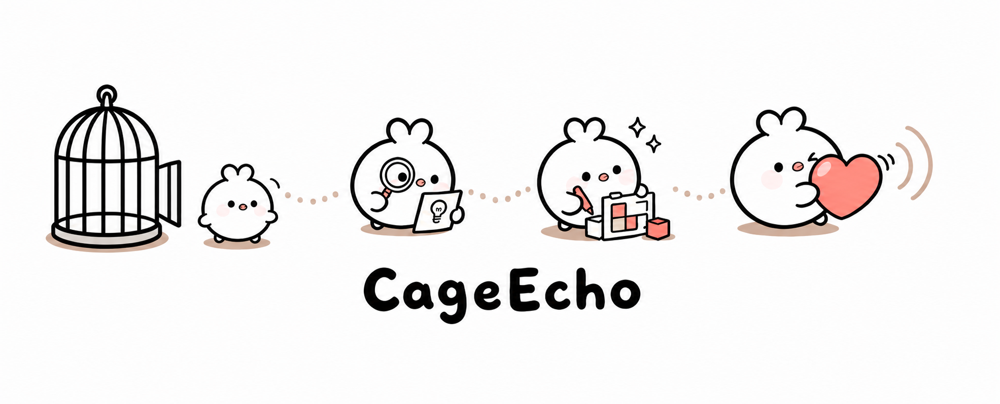

  

  让想法冲出笼子，让作品留下回声。

| **LISTEN** | **DISSECT** | **BUILD** | **ECHO** |
| :---: | :---: | :---: | :---: |
| 听见真实问题 | 拆开产品与观点 | 做成可用的东西 | 让作品持续传播 |

## 🕊️ 我把脑海里的回声，做成能运行的产品

我是 **CageEcho**，一个关注 **AI 产品、效率工具与内容表达** 的独立构建者。

我喜欢拆开一个产品，看清它为什么成立；也喜欢把脑海里的回声做成原型、工具和可复用的 AI Skills。对我来说，观点不该只停在文章里，代码也不该只停在仓库里——想法只有飞出笼子，才会遇见真实的用户。

  🧭 <a href="https://github.com/ZSYsabre?tab=repositories">全部项目</a>
  &nbsp;·&nbsp; 💬 <a href="https://github.com/ZSYsabre">GitHub</a>

---

## ⭐ 代表作

| Project | 它解决什么 | Live proof |
| --- | --- | --- |
| 🖥️ [wow-super-desktop](https://github.com/ZSYsabre/wow-super-desktop) | 把文件、知识库与 AI 放进一个本地优先的无限画布桌面 |  |
| 🐾 [PET-MOUTHPIECE](https://github.com/ZSYsabre/PET-MOUTHPIECE) | 上传萌宠照片，一次生成 6 张可直接分享的中文毒舌表情包 |  |
| 🎮 [Game-ai-skill](https://github.com/ZSYsabre/Game-ai-skill) | 用事实材料支撑游戏评测、玩法叙事拆解与 AI 开发复盘 |  |
| ✍️ [write-sharp-skill](https://github.com/ZSYsabre/write-sharp-skill) | 把中文观点文章写得更有立场、有材料，也更值得讨论 |  |

## 🎯 我在做什么

- **AI 产品 × 动手交付**：从问题定义、交互原型走到可以运行的桌面应用和 Web MVP。
- **产品拆解 × 多重视角**：不只评价表面功能，更关心需求、机制、用户行为与时代情绪如何彼此影响。
- **Agent Skills × 工作流**：把游戏分析、中文写作等方法沉淀成可以重复调用的 AI 能力。
- **内容表达 × 公开构建**：用项目、文章和真实反馈验证判断，而不是让想法停在一张流程图里。

## 🔭 最近在推进

- 继续打磨 **哇塞·超级桌面**：一个本地优先的文件、知识库与 AI 无限画布桌面应用。
- 探索更有用的 **AI 原生小产品**，让模型能力真正进入可分享、可验证的体验。
- 把产品观察和创作方法整理为开放的 **Skills 与项目拆解**。

---

  LET IDEAS OUT · BUILD HONESTLY · MAKE THEM ECHO

